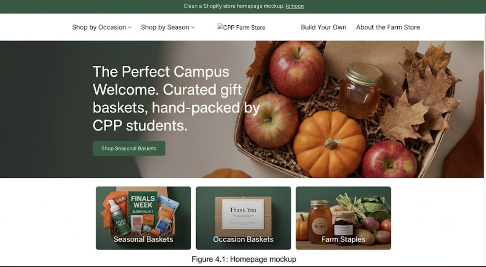
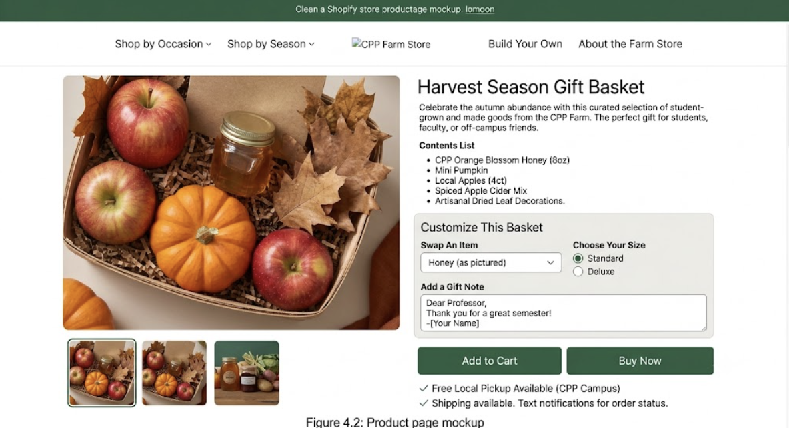
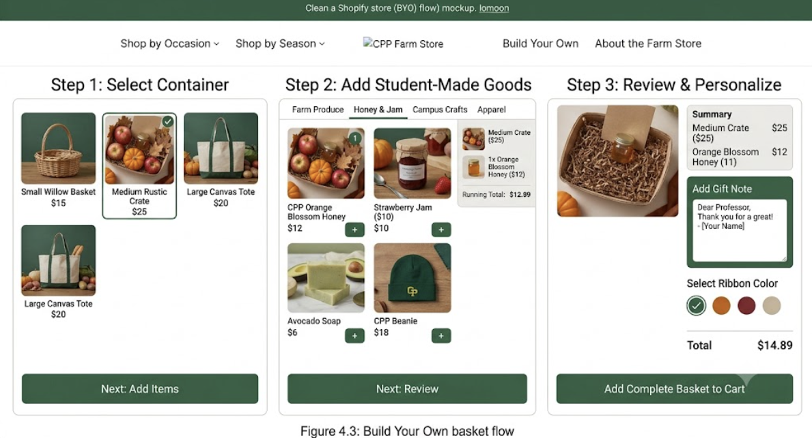
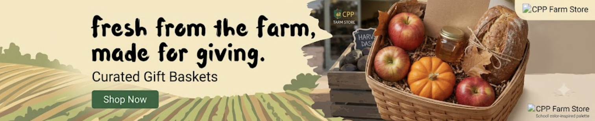
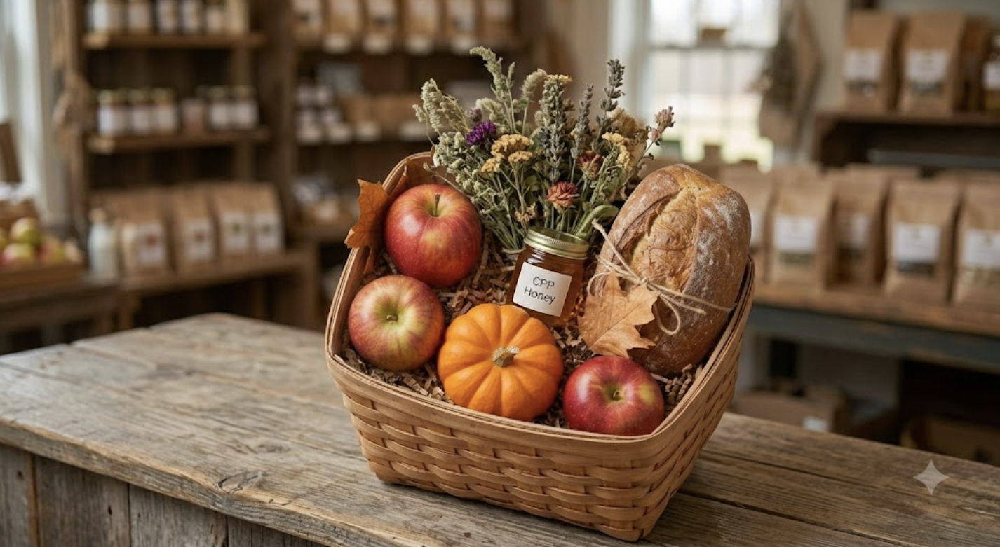
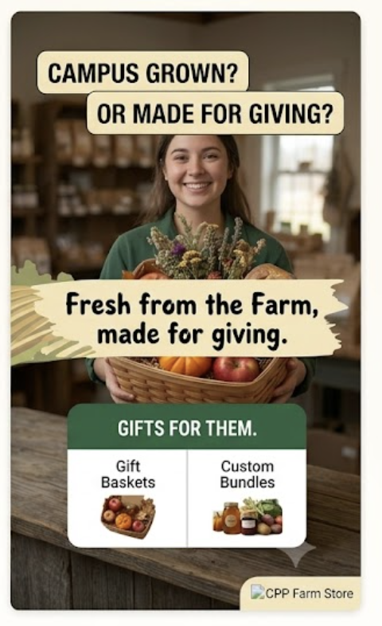

## Executive Summary

CPP Farm Store is a student-run store at Cal Poly Pomona that sells fresh produce, estate wine, plants, honey, and custom gift items — all grown on site. Most people don't know it exists, and those who do find the website confusing.

**Recommendation:** Build a connected omnichannel strategy by improving Shopify, launching a gift box campaign, setting up Google Merchant Center, and adding loyalty and email tools.

**What we found:** Customers drop off between Awareness and Consideration — not enough product info online, unclear checkout, and zero post-purchase communication.

**Projected results:** 40% increase in gift box orders, 25% jump in traffic, 3% conversion rate, and a growing base of repeat customers.

## Client and Situation Analysis

**About CPP Farm Store**

- Founded on W.K. Kellogg's 1925 horse ranch, now part of Cal Poly Pomona
- Operated by the Huntley College of Agriculture as a student-run enterprise
- Students grow, harvest, market, and sell everything themselves
- Located at 4102 S. University Drive \| Open Daily 10AM–6PM

**Products:** Fresh produce, estate wine, plants, honey, eggs, student-made ice cream, and custom gift boxes

## Target Customers

- **CPP Students** — on campus daily but largely unaware the store exists
- **Faculty & Staff** — reliable shoppers, easiest to retain
- **Local Community** — find via Google, blocked by navigation and parking friction
- **Alumni** — emotionally connected, ideal gift box buyers, rely on digital
- **Online-First Shoppers** — expect smooth browsing, checkout, and pickup

## Product Categories

- **Fresh produce & agricultural goods** — fruits, vegetables, eggs, honey
- **Specialty products** — estate wine, student-made ice cream, jams
- **Nursery & ornamentals** — plants and seasonal items
- **Gift products** — customizable gift boxes and fruit packs *(highest margin, lowest visibility)*

## Strengths & Weaknesses

**Strengths**

- Authentic student-run story no competitor can replicate
- High-quality standout products drive word of mouth
- Built-in campus audience every day
- Shopify store already live

**Weaknesses**

- Low awareness on and off campus
- Incomplete Google profile, no retail media presence
- Confusing checkout, no order confirmation or pickup updates
- No loyalty program or post-purchase follow-up

## Opportunities & Challenges

**Opportunities**

- Growing demand for local, mission-driven food
- Seasonal gifting: Mother's Day, graduation, holidays
- Google Shopping tools accessible for small businesses
- Campus event traffic that can convert to online customers

**Challenges**

- Farmers' markets and national gift brands (Amazon, Edible Arrangements) competing for the same budget
- Rotating student staff affects consistency
- Campus parking and navigation deters off-campus visitors

## SWOT Summary

|   | Helpful | Harmful |
|------------------------|------------------------|------------------------|
| **Internal** | Campus-grown story, quality products, Shopify foundation, loyal alumni | Low awareness, poor discoverability, no post-purchase communication |
| **External** | Local food trends, Google Shopping, seasonal gifting windows | Stronger competitors, campus barriers, limited budget |

# 3. Key Customer Journey Insight

**Target Customers**

- **Students** — On-campus shoppers who value affordability, local products, and digital promotions.
- **Faculty & Staff** — Frequent customers who prioritize convenience and reliable product availability.
- **Alumni** — High-value gift shoppers with a strong emotional connection to CPP.
- **Local Community Members** — Local shoppers who value quality but face parking, navigation, and awareness barriers.
- **Online-First Shoppers** — Digital customers who expect easy browsing, ordering, checkout, and pickup.

**Key Insight**

- Local Community Members and Online-First Shoppers experience the greatest friction.
- The biggest opportunity is connecting **online discovery → product research → ordering → pickup → repeat purchase**.
## Customer Journey Opportunity

**Create a Connected Omnichannel Experience**

- **Online Discovery** — Increase visibility through Google Search, social media, email, campus events, and Google Merchant Center.

- **Product Research** — Improve Shopify with clear product photos, pricing, availability, store hours, location, and parking information.

- **Online Ordering** — Simplify customization, secure checkout, pricing, and automatic order confirmation.

- **Store Pickup** — Provide scheduled pickup times, designated parking, clear directions, and curbside pickup options.

- **Post-Purchase Engagement** — Use follow-up emails, seasonal promotions, product recommendations, and loyalty incentives.

**Key Takeaway**

- Connect the entire journey: **Discover → Research → Order → Pickup → Engage → Repeat**

# 4. Shopify / Ecommerce Recommendation

## Shopify Prototype

- Purpose: extend the in-person Farm Store experience online through a curated gift basket line
- Categories: seasonal baskets, occasion baskets, farm staple bundles
- Homepage: hero banner for current seasonal basket, category tiles below
- Navigation: five items only (Shop by Occasion, Shop by Season, Farm Staples, Build Your Own, About the Farm Store)

## Customer Experience Improvements

- Customizable baskets: swap items, add note card, choose size
- Gift Basket form for personalized, scheduled orders
- Store pickup (BOPIS) keeps the in-person visit part of the experience
- Mobile-friendly layout for on-the-go campus browsing

## Prototype Evidence: Homepage

{width=75%}

## Prototype Evidence: Product & Basket Flow

{width=45%} {width=45%}

# 6. Campaign Strategy

### Business Problem

- CPP Farm Store's current website runs on Wix, which cannot process online orders — customers must call or visit in person, no matter how much interest they have after browsing

### Campaign Objective

- Increase awareness and adoption of CPP Farm Store's online gift box ordering option.
- Drive customers from digital channels to Shopify and in-store pickup.

### Campaign Message

**Thoughtful Gifts, Grown Here**

### Target Audience

- Students
- Families
- Faculty and staff
- Campus organizations
- Local customers

### Channels

- Instagram
- TikTok
- Google Search
- Google Shopping
- Email
- Campus signage
- Shopify

### Campaign KPIs

- Website traffic
- Product page views
- Click-through rate
- Add-to-cart rate
- Conversion rate
- Purchases
- Revenue

# 7. Creative Examples

## Creative Objective

- Objective: build awareness and drive consideration for gift baskets as a campus/community gifting option
- Key message: "Fresh from the Farm, made for giving"
- Tone: warm, handmade, community-rooted, not corporate or polished

## Creative Assets

{height="2in"} {height="2in"} {height="2in"}

## Channel Fit

- Instagram: primary channel for visual, gift-forward content
- Email: supports basket promotions and seasonal launches
- On-site banners: reuse creative to stay consistent with Shopify site

## AI Use

- AI image generation (Canva) used for basket and mockup visuals
- Allowed testing of creative direction without a photography budget or live Shopify build

# 8. Dashboard and Measurement Plan

## Analytics Dashboard

The CPP Farm Store Omnichannel Performance Dashboard was developed in Looker Studio to demonstrate how CPP Farm Store could monitor ecommerce, marketing, product, and omnichannel performance.

The dashboard uses **simulated data for educational purposes** because complete live CPP Farm Store ecommerce data were not available.

## Measurement Objectives

The dashboard is designed to:

- Measure website traffic and customer activity
- Track product engagement
- Compare marketing-channel performance
- Evaluate campaign effectiveness
- Monitor purchases and revenue
- Identify high-performing products
- Measure store pickup interest
- Support future data-driven decisions

## Key Performance Indicators

- **Total Users:** 980
- **Sessions:** 1,138
- **Product Views:** 796
- **Purchases:** 126
- **Revenue:** \$2,644
- **Conversion Rate:** 11.07%
- **Average Order Value:** \$20.98
- **Store Pickup Interest:** 65

## Dashboard Visualizations

The dashboard includes:

- Website Sessions Over Time
- Sessions by Marketing Channel
- Purchases by Campaign
- Product Performance
- Campaign Performance
- Conversion Rate
- Average Order Value
- Store Pickup Interest

## Dashboard

{width="95%"}

## Key Dashboard Insights

- Multiple channels contribute to website traffic, supporting an omnichannel marketing approach.
- High website traffic does not automatically mean stronger campaign performance.
- Campaigns should be evaluated using purchases, revenue, and conversion rate in addition to sessions.
- Product-level performance can identify where customers show interest but do not complete a purchase.
- Store Pickup Interest helps connect digital activity with the physical CPP Farm Store.

## What Should Be Measured?

The dashboard should help CPP Farm Store determine whether the new digital Gift Basket ordering process is improving customer behavior.

Important measures include:

- Gift Basket product page views
- Online Gift Basket form starts
- Completed Gift Basket orders
- Add-to-cart activity
- Conversion rate
- Revenue
- Average Order Value
- Store Pickup Interest
- Traffic source

## Recommended Measurement Actions

CPP Farm Store should:

- Monitor traffic and conversion performance together.
- Invest more heavily in campaigns that generate purchases and revenue.
- Improve product pages when views do not translate into purchases.
- Make store pickup highly visible throughout the ecommerce experience.
- Regularly review dashboard data and adjust marketing decisions.
- Replace simulated data with live GA4 and Shopify data when available.

## Measurement Opportunity

A digital Gift Basket ordering process would provide CPP Farm Store with data that a paper form cannot easily provide.

With Shopify and GA4, the Farm Store could measure:

**Discovery → Product View → Order Intent → Completed Order → Store Pickup**

This would allow management to identify where customers leave the ordering process and continuously improve the experience.

# 9. Final Recommendations
## Recommendation 1 — Highest Priority

**Fix the Digital Purchase & Pickup Experience**

- **Action** — Improve Shopify product pages, simplify checkout, automate order confirmations, and provide clear pickup, parking, and store information.

- **Why It Matters** — The greatest customer friction occurs between product consideration, online purchase, and physical pickup.

- **Resources** — Shopify updates • Product photos/content • Email automation • Pickup signage • Staff training

- **Measurement** — Conversion Rate • Cart Abandonment • Purchases • Store Pickup Interest • AOV

---

## Recommendation 2 — Medium-Term Opportunity

**Launch an Integrated Gift Box Campaign**

- **Action** — Promote custom gift boxes across Google, email, campus events, in-store QR codes, and the Shopify landing page.

- **Why It Matters** — Custom gift boxes combine CPP's local story with high-demand occasions such as Graduation, Mother's Day, and holidays.

- **Resources** — Google Ads • Email Marketing • Campaign Creative • Event Displays • QR Codes • Shopify Landing Page

- **Measurement** — **+25% Product Page Traffic • 3% Conversion Rate • +40% Gift Box Orders**

---

## Recommendation 3 — Future Opportunity

**Build Loyalty & Customer Retention**

- **Action** — Introduce automated post-purchase emails, seasonal reminders, personalized recommendations, and loyalty rewards.

- **Why It Matters** — Turning satisfied first-time shoppers into repeat customers reduces dependence on continuous customer acquisition.

- **Resources** — Email/CRM Platform • Shopify Integration • Loyalty Tools • Customer Segmentation

- **Measurement** — Repeat Purchase Rate • Returning Customers • Email CTR • Customer Lifetime Value • **20% Repeat-Purchase Goal**

# 10. Closing

## From Paper Forms to a Connected Customer Journey

One of the clearest opportunities identified in this project is CPP Farm Store's Gift Basket ordering process.

Instead of requiring customers to visit the store and complete a paper order form, CPP Farm Store can allow customers to **discover, customize, and order Gift Baskets online through Shopify**.

The physical Farm Store would remain an important part of the experience through preparation, fulfillment, and customer pickup.

## Recommended Customer Journey

**Discover Online**

↓

**View Gift Basket Options**

↓

**Customize & Order Through Shopify**

↓

**Receive Order Confirmation**

↓

**Pick Up at CPP Farm Store**

↓

**Receive Follow-Up Marketing**

## Overall Value

This strategy connects every major part of our project:

- The **customer journey** identifies the friction.
- **Shopify** provides the digital ordering solution.
- The **product feed** improves online discovery.
- The **campaign** promotes the new ordering option.
- The **creative assets** communicate the offering.
- The **analytics dashboard** measures whether customers use it.

## Final Takeaway

CPP Farm Store does not need ecommerce to replace the physical Farm Store.

It can use ecommerce to eliminate unnecessary steps such as paper Gift Basket ordering while making the physical store more convenient and valuable.

**The goal is a simpler journey: order online, pick up at the Farm Store.**

# 11. Appendix

## Project Links

- **Final Report:** \[Insert link\]
- **GitHub Pages:** \[Insert link\]
- **GitHub Repository:** \[Insert link\]
- **Shopify Prototype:** \[Insert link\]
- **Looker Studio Dashboard:** \[<https://datastudio.google.com/reporting/f8db8c82-30a9-4c24-a7f8-04d69d73dd7c>\]
- **Google Drive Folder:** \[Insert link\]
- **Product Feed:** \[Insert link\]

## Additional Evidence

- \[Shopify screenshots\]
- \[Gift Basket form screenshots\]
- [Creative assets]
- \[Product feed\]
- [Dashboard]
- \[Additional project materials\]

# Thank You

## Questions?
